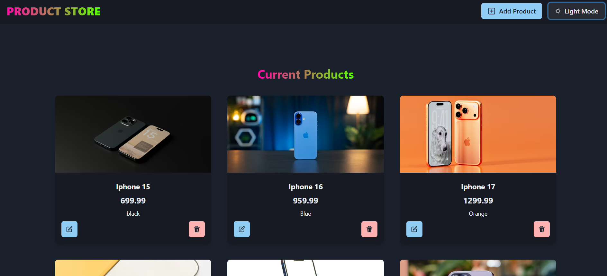
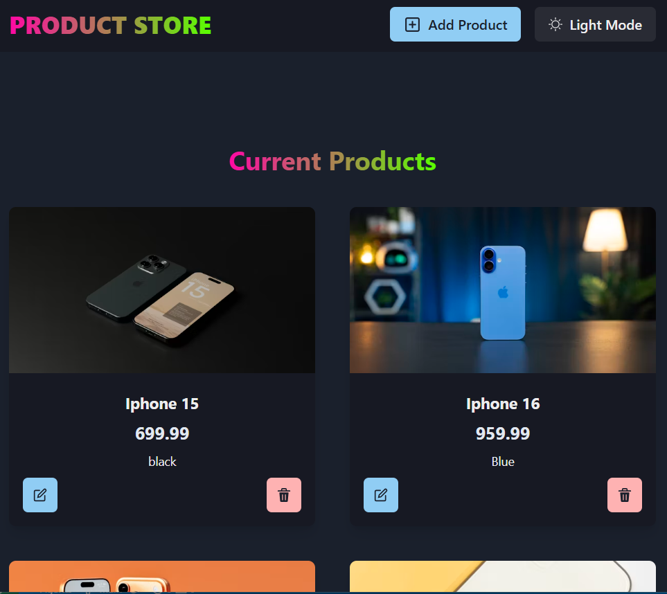
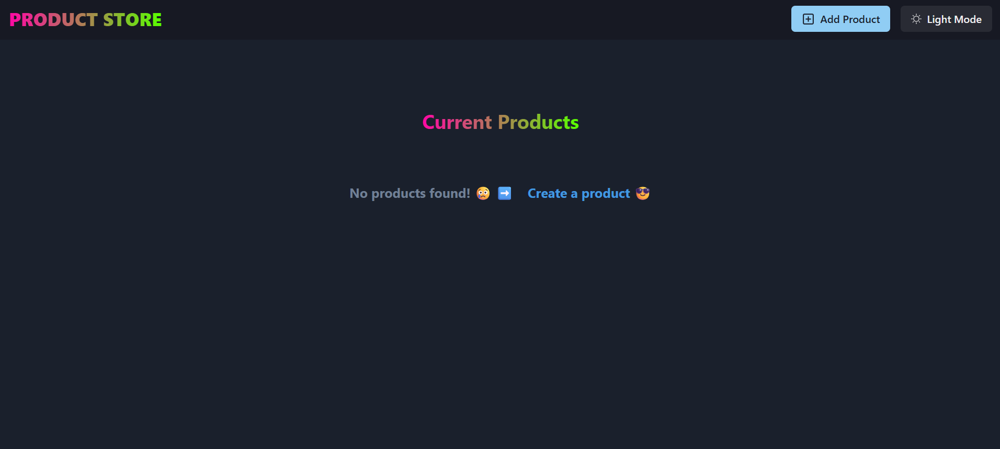

# Fullstack Product Management Website

This project was built to practice and demonstrate **fullstack development**, combining both **frontend** and **backend** in a modern web application.  
The entire app is written in **JavaScript**, using popular frameworks and tools.  

---

## 🔧 Technologies Used

### Frontend
- **React** – component-based UI library for building flexible and reusable interfaces.  
- **Vite** – fast build tool and development server for React.  
- **Chakra UI** – modern React component library for accessible and customizable UI elements.  
- **React Icons** – library for adding icons to the UI (e.g. Edit, Delete).  
- **Zustand** – lightweight and powerful state management for handling product data.  

### Backend
- **Node.js** – runtime environment for running JavaScript on the server.  
- **Express.js** – minimal and flexible backend framework for building APIs.  
- **MongoDB** – NoSQL database for storing products (name, price, description, image link).  
- **Mongoose** – ODM for structuring MongoDB data and simplifying CRUD operations.  

### Other Tools
- **Postman** – for testing API endpoints (GET, POST, PUT, DELETE).  
- **Nodemon** – auto-restart tool for the backend server during development.  

---

## 📂 Project Structure

### Backend (`/backend`)
- `config/db.js` – MongoDB connection setup.  
- `controllers/product.controller.js` – business logic for API routes.  
- `models/product.model.js` – schema and model definition for products.  
- `routes/product.route.js` – all API endpoints (`/api/products`).  
- `server.js` – Express server configuration and startup.  

### Frontend (`/frontend`)
- `src/components`  
  - `Navbar.jsx` – navigation menu.  
  - `ProductCard.jsx` – product card with name, price, description, image and action buttons.  
  - `ui/ClientOnly.jsx` – utility component to render only on the client side.  
- `src/pages`  
  - `HomePage.jsx` – displays all products.  
  - `CreatePage.jsx` – form for adding new products (all fields are required).  
- `src/store/product.js` – Zustand store handling state and API requests.   

---

## ✨ Features
- **Display products** (GET `/api/products`) – shows all items as cards on the homepage.  
- **Add new product** (POST `/api/products`) – form validation ensures all fields are filled.  
- **Update product** (PUT `/api/products/:id`) – modal for editing product details.  
- **Delete product** (DELETE `/api/products/:id`) – removes item from database and UI.  
- **Interactive UI** – hover effects, animations, color transitions and scaling.  

---

## 🚀 How to Run

1. **Clone repository**
   ```bash
   git clone https://github.com/ElinKat/Website.git

2. **Open first terminal**

   cd backend
   npm install
   npm run dev

3. **Open second terminal**

   cd frontend
   npm install
   npm run dev
   
The frontend will start on http://localhost:5173


## 🏠 Home Page
  
This is the main landing page of the application, where all products are displayed as cards. Each card shows the product name, price, description and image.  

---


## 🌙 Home Page in Dark Mode
  
The homepage shown in dark mode. On this page, you can:  
- Add new products using the **“Add Product”** button  
- Switch between light and dark modes  
- Delete or update existing products in the list  

---

## ☀️ Home Page in Light Mode
  
The same homepage in light mode. The overall functionality remains the same, with a different visual style.  

---

## ➕ Create New Product Page
  
This page is opened when clicking the **“Add Product”** button. It provides a form to create a new product by filling in:  
- Product Name  
- Price  
- Description  
- Image URL  

All fields are required.  

---

## ✏️ Edit Product Window
  
This modal window allows updating a product’s details:  
- Name  
- Price  
- Description  
- Image  

You can cancel and close the modal at any time.  
- If the update is successful, a **success toast** notification appears  
- If no changes are made and the update button is pressed, an **error toast** is shown
- Updates are applied instantly to the product list without needing to refresh the page 

---

## ✅ Update Successful Toast
  
A confirmation message (toast) is displayed when a product is successfully updated. This provides quick feedback without reloading the page.

## 📱 Responsive Layout (Small Screen)


On smaller screens, the layout automatically adjusts to display **two products per row** instead of the full grid.  
This makes the app mobile-friendly and ensures products remain easy to view regardless of screen size.  
The responsive behavior is handled using **Chakra UI’s responsive grid system** combined with React and Vite.  

---

## 📝 No Products State


If there are no products available, the homepage displays a clear message:  

> **No products yet 😢 ➡️ Create a product 😎**

The phrase *“Create a product 😎”* is a **clickable link** that redirects the user to the product creation page.  
This improves user experience by guiding them to the next step without confusion.  
The text is styled with **Chakra UI**, including hover animations (color change and scale effect).  


